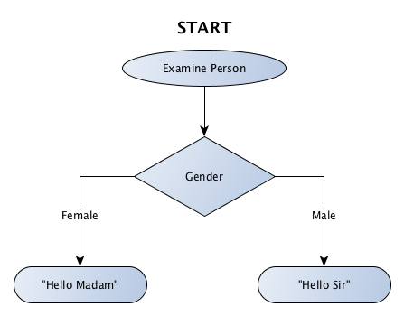

## Scenario 2:

### Step 1- How might this look as a flow chart?

[](#s02s01)


### Step 2 - How could we write this in Pseudo code?
[](#s02s02)

```
If gender is female then say "Hello Madam"; otherwise say "Hello Sir"
```

### Step 3 - Now let's try in code?
[](#s02s03)

[Code](https://play.golang.org/p/p636I-920f)

Try changing `gender := "Male"` to `gender := "Female"` and click the "Run" button and see what happens.

## Scenario 3:

### Step 2 - How could we write this in Pseudo code?
[](#s03s02)

```
Is the toast undercooked? If Yes, cook it more.
Is the toast perfect? If Yes, then eat it.
Is the toast burnt? If Yes, then throw it out.
```

### Step 3 - Now let's try in code?
[](#s03s03)

[Code](https://play.golang.org/p/ezhOyazjbq)

Try changing `toastIs := "Undercooked"` to:
* `toastIs := "Perfect"`
* `toastIs := "Burnt"`

Click the "Run" button and see what happens.
