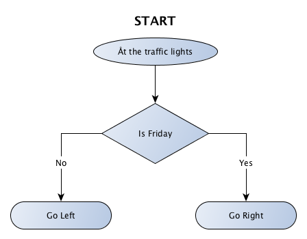
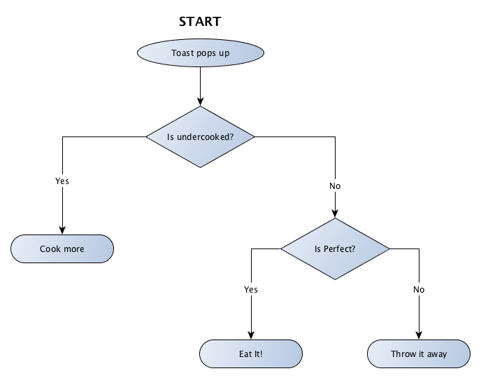

# Episode 01 - If / Else

As a programmer, you will quickly learn that while computers don't always do what you want them to do; 
they will almost always do what you tell them to.

How do you tell a computer what to do?  Great question.  
All programming languages include a concept called "control structures".

Now don't let the jargon worry you, they are perhaps better described as "directions".
They are instructions that "control" how the computer behaves.

Anyway, let's get on with it.

In this episode we will look at the "if / else".

The "if / else" describes a decision where are 2 possible outcomes.

## Scenario 1:

Imagine you are driving home from work.
You turn off the highway and come to the traffic lights.

Every day except Friday, you turn left to your house but on Friday, you turn right and go out dancing with your girlfriends.

*Step 1* - First thing we should do is turn this into a flowchart
 


*Step 2* - Let's see if we can re-write this in something more concise.  We will call this "pseudo code".

```
If today is Friday then go right; otherwise go left.
```

*Step 3* - Now let's try some real code

```
if today == "Friday" {
	fmt.Println("Turn right")
} else {
	fmt.Println("Turn left")
}
```

[Here is the "running" code.](https://play.golang.org/p/icWSQVamqv)
Try changing `today := "Friday"` to `today := "Wednesday"` and click the "Run" button and see what happens.


## Scenario 2:

Imagine you are creating a very polite robot.

You want the robot to say "Hello Sir" or "Hello Madam" depending on the gender of person it is talking to.

### Step 1 - How might this look as a flow chart?

[Sample answer](01-If-Else-samples.md#s02s01)

### Step 2 - How could we write this in Pseudo code?

[Sample answer](01-If-Else-samples.md#s02s02)

### Step 3 - Now let's try in code?

[Sample answer](01-If-Else-samples.md#s02s03)

## Scenario 3: 

As you can see in the above examples, If/Else is very good for decisions where there are 2 possible outcomes.

But what happens where there is more than 2 outcomes?

While there are more efficient ways to handle this that we can learn later, we can get the job done If/Else.
 
Imagine you are cooking a piece of toast.

You put a piece of bread in the toaster and press down the lever.
After a little while the bread pops up and you examine it.

Several outcomes are possible:
* If the toast is undercooked, you will press the lever down again.
* If the toast is burnt, you will throw it away and try again
* If the toast is perfect, you will eat it.

### Step 1 - How might this look as a flow chart?


We have a problem, there are 3 possible outcomes but "If/Else" can only handle 2.

Actually, we can around this problem by breaking the situation down to a series of decisions where each decision has only 2 outcomes.

Consider asking a series of questions that all have "Yes/No" answers.

Like this 

### Step 2 - How could we write this in Pseudo code?

[Sample answer](01-If-Else-samples.md#s03s02)

### Step 3 - Now let's try in code?

[Sample answer](01-If-Else-samples.md#s03s03)
