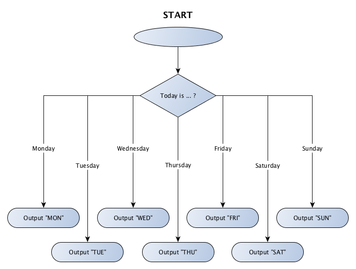

## Scenario 2:

### Step 1- How might this look as a flow chart?



### Step 2 - How could we write this in Pseudo code?

```
If today is:
		Monday then output "MON"
		Tuesday then output "TUE"
		Wednesday then output "WED"
		Thursday then output "THU"
		Friday then output "FRI"
		Saturday then output "SAT"
		Sunday then output "SUN"
```

### Step 3 - Now let's try in code?

[Code](https://play.golang.org/p/bA8YEl3_-d)

Try changing the date and click the "Run" button and see what happens.

## Scenario 3:

### Step 1- How might this look as a flow chart?


### Step 2 - How could we write this in Pseudo code?

```
We roll a dice.
If we roll:
	1 then we lose
	6 then we win
	2-5 then we roll again
```

### Step 3 - Now let's try in code?

[Code](https://play.golang.org/p/v8p8ZnvHUz)

Try changing `weRolled := 1` to different numbers, click the "Run" button and see what happens.
