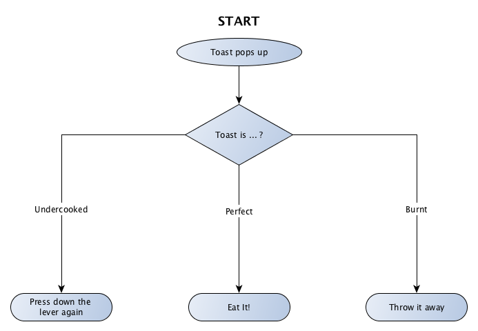
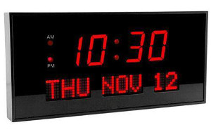

# Episode 02 - Switch

In the [previous episode](01-If-Else.md) we looked at "If / Else" which was good for decisions that have only 2 
possible outcomes.  But what happens when you have more than 2 outcomes?

We saw that you could write many if/else statements together but this tends to get messy really fast.

In this episode we will be using "Switch".  "Switch" is similar to "If / Else" in that it controls the flow of program.

"Switch" consists of 2 parts: 
1. A decision - this is referred to as the switch condition
2. 1 or more outcomes - these are calls "cases"

## Scenario 1:

Let's revise the last scenario from the previous episode.

Imagine you are cooking a piece of toast.

You put a piece of bread in the toaster and press down the lever.
After a little while the bread pops up and you examine it.

Several outcomes are possible:
* If the toast is undercooked, you will press the lever down again.
* If the toast is burnt, you will throw it away and try again
* If the toast is perfect, you will eat it.

### Step 1 - How might this look as a flow chart?



*Step 2* - Let's see if we can re-write this in something more concise.  We will call this "pseudo code".

In this case we kinda already have this in the description:
* If the toast is undercooked, you will press the lever down again.
* If the toast is burnt, you will throw it away and try again
* If the toast is perfect, you will eat it.

*Step 3* - Now let's try some real code

```
switch toastIs {
	case "undercooked":
		fmt.Println("press the lever down again")
		
	case "perfect":
		fmt.Println("eat it!")
		
	case "overcooked":
		fmt.Println("throw it out")		
}
```

[Here is the "running" code.](https://play.golang.org/p/C8HJLMOv4K)
Try changing `toastIs := "overcooked"` to `toastIs := "perfect"` and click the "Run" button and see what happens.


## Scenario 2:

Imagine you have been asked to program a digital clock and on that clock you want to put the day of the week.

Something like the bottom left corner of this clock.




### Step 1 - How might this look as a flow chart?

[Sample answer](02-Switch-samples.md#step-1--how-might-this-look-as-a-flow-chart)

### Step 2 - How could we write this in Pseudo code?

[Sample answer](02-Switch-samples.md#step-2---how-could-we-write-this-in-pseudo-code)

### Step 3 - Now let's try in code?

[Sample answer](01-Switch-samples.md#step-3---now-lets-try-in-code)


## Scenario 3:

For this last scenario we are going to use a special feature we haven't used before.
It's call the "default" case.

As you might be able to guess, this case will be run when no other cases match.

Imagine you are programming a dice game.

In this game, rolling a 1 will cause you to lose; rolling a 6 will cause you to win and any other number you will roll 
again.


### Step 1 - How might this look as a flow chart?

[Sample answer](02-Switch-samples.md#step-1--how-might-this-look-as-a-flow-chart-1)

### Step 2 - How could we write this in Pseudo code?

[Sample answer](02-Switch-samples.md#step-2---how-could-we-write-this-in-pseudo-code-1)

### Step 3 - Now let's try in code?

[Sample answer](01-Switch-samples.md#step-3---now-lets-try-in-code-1)
